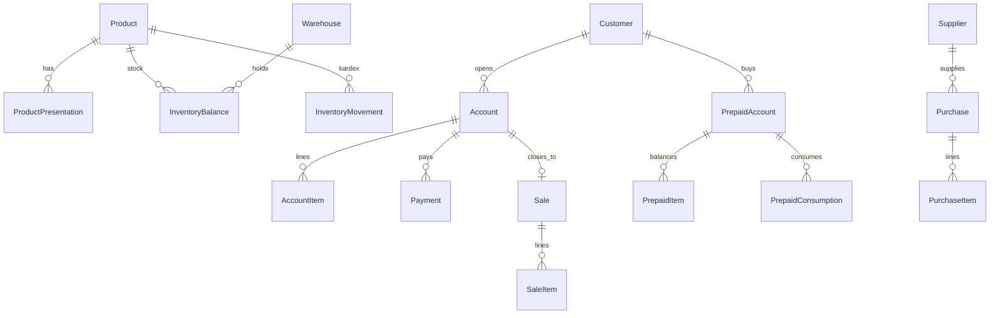

# A&D Licorería & Bodegón — Modelo administrativo real (Fase 4 · DISEÑO)

> **Estado:** diseño funcional y de datos.  
> **No implementar** todavía PostgreSQL / Prisma / `apps/api` / migraciones.  
> **Mock actual:** portal `/licoreria`, repositorio en memoria, suite Fase 3 (14/14) + escenario COP Fase 7 (25/25).  
> **Fase 7:** COP `/licoreria/cop`, `getOperationalAvailability()`, transferencias multiproducto, pre-factura, compromisos cliente.  
> **Objetivo:** contrato estable para sustituir `adLicoreriaRepository` por API real sin rehacer la UI.

---

## Índice

A. [Modelo funcional](#a-modelo-funcional)  
B. [Entidades](#b-entidades)  
C. [Relaciones](#c-relaciones)  
D. [Estados](#d-estados)  
E. [Reglas de negocio](#e-reglas-de-negocio)  
F. [Permisos / roles](#f-permisos--roles)  
G. [Contratos API futuros](#g-contratos-api-futuros-repository--api)  
H. [Eventos WhatsApp futuros](#h-eventos-whatsapp-futuros)  
I. [Reportes](#i-reportes)  
J. [Decisiones de negocio pendientes](#j-decisiones-de-negocio-pendientes)

---

## A. Modelo funcional

A&D es un **sistema administrativo de licorería/bodegón**, no solo un POS.

| Dominio | Responsabilidad |
|---|---|
| Catálogo | Producto ≠ Presentación; precios USD/Bs independientes; costos/margen |
| Inventario | 2+ depósitos; stock en **unidad base**; kardex obligatorio |
| Compras | Entrada controlada desde proveedor → depósito |
| Ventas / POS | Cuentas, servicio parcial, pagos mixtos, recibos |
| Mesoneras / mesas | Quién sirve qué, dónde |
| Clientes | Teléfono obligatorio; historial; saldos; prepagos |
| Prepagos / QR | Saldo de mercancía + token opaco |
| Caja | Apertura, movimientos, cierre esperado vs contado |
| Cierres | Caja + inventario físico vs teórico |
| Reportes | Derivados de hechos persistidos (no inventados) |
| Auditoría | before/after/motivo en operaciones sensibles |
| WhatsApp | Cola de mensajes mock → API futura |

### Separación de capas (mantener)

```
UI (pages/ad-licoreria)
  → Provider (useSyncExternalStore)
    → Repository (hoy mock / mañana HTTP)
      → PostgreSQL + Prisma (futuro, fuera de este doc de implementación)
```

Conversiones a unidad base: **solo** `src/lib/ad-licoreria/conversions.ts` (o equivalente backend único).  
La UI no recalcula stock por su cuenta.

---

## B. Entidades

Convención de nombres: español de negocio en docs; camelCase/inglés en tipos TS actuales; snake_case en SQL futuro.

### 1. Productos / catálogo

#### `Product` (Producto)
| Campo | Tipo | Notas |
|---|---|---|
| id | UUID | |
| name | string | |
| brand | string | Marca |
| categoryId | FK → Category | |
| sku | string | Único |
| barcode | string? | |
| baseUnitLabel | string | Ej. `unidad`, `botella` |
| costUsd / costBs | decimal | Costo de referencia (unidad base) |
| minStockBase | number | Alerta |
| active | boolean | |
| notes | string? | |
| createdAt / updatedAt | datetime | |

#### `Category`
| Campo | Tipo |
|---|---|
| id, name, slug, active | |

#### `ProductPresentation` (Presentación)
| Campo | Tipo | Notas |
|---|---|---|
| id | UUID | |
| productId | FK | |
| name | string | Individual, Balde, Caja x36 |
| code | string? | Código presentación |
| sku / barcode | string? | |
| unitsPerPresentation | number > 0 | **Conversión configurable** |
| priceUsd / priceBs | decimal | **Independientes** |
| minPriceUsd/Bs, maxPriceUsd/Bs | decimal? | |
| costUsd / costBs | decimal? | Costo por presentación (opcional; si falta, cost_base × factor) |
| active | boolean | |
| isDefault | boolean? | |

**Ejemplo**

```
Producto: Cerveza Regional
Unidad base: unidad

Presentaciones:
  Individual → factor 1  · USD $X · Bs Y
  Balde      → factor N  · USD $X · Bs Y   (N configurable)
  Caja x36   → factor 36 · USD $X · Bs Y
```

`margen_estimado = precio_venta − costo` (por moneda; no mezclar sin tasa explícita).

---

### 2. Inventario

#### `Warehouse` (Depósito)
| Campo | Tipo |
|---|---|
| id, code, name | |
| kind | `PRIMARY` \| `SECONDARY` \| `OTHER` |
| active | boolean |

Mínimo operativo: **Depósito 1** (bodega), **Depósito 2** (barra/servicio).

#### `InventoryBalance` (Existencia)
| Campo | Tipo | Notas |
|---|---|---|
| productId | FK | Stock **siempre en unidad base** |
| warehouseId | FK | |
| qtyBase | number ≥ 0 | |
| updatedAt | datetime | Unique(productId, warehouseId) |

#### `InventoryMovement` (Kardex)
| Campo | Tipo | Notas |
|---|---|---|
| id | UUID | |
| type | enum | ver abajo |
| productId | FK | |
| presentationId | FK? | Para auditar factor usado |
| qtyPresentation | number | Cantidad en presentación (si aplica) |
| qtyBase | number | = qtyPresentation × factor |
| warehouseId | FK | Depósito afectado |
| warehouseFromId / warehouseToId | FK? | Traslados |
| userId / userName | | |
| reference | string? | saleId, accountId, purchaseId… |
| reason / notes | string? | |
| createdAt | datetime | **Inmutable** |

**Tipos de movimiento**

| Tipo | Efecto stock |
|---|---|
| COMPRA | + destino |
| VENTA | − (POS cobro inmediato / legacy) |
| CONSUMO_CUENTA | − al **servir** |
| DEVOLUCION | + (anulación/reversión) |
| TRASLADO_SALIDA / TRASLADO_ENTRADA | − origen / + destino |
| AJUSTE_ENTRADA / AJUSTE_SALIDA | ± |
| PERDIDA / ROTURA | − |
| INVENTARIO_INICIAL | + |
| CONTEO_FISICO | registro; ajuste vía AJUSTE_* |

**Regla:** nunca mutar `InventoryBalance` sin insertar `InventoryMovement`.

---

### 3. Compras

#### `Supplier` (Proveedor)
| Campo | Tipo |
|---|---|
| id, name | |
| phone | string? |
| identification | string? | RIF/CI |
| address | string? |
| contactName | string? |
| email | string? |
| active | boolean |
| notes | string? |
| createdAt | |

#### `Purchase` (Compra)
| Campo | Tipo |
|---|---|
| id | |
| supplierId | FK |
| invoiceNumber | string | |
| date | date | |
| warehouseId | FK | Destino |
| status | enum | BORRADOR / RECIBIDA / ANULADA |
| paymentMethod | enum? | |
| reference | string? | |
| totalCostUsd / totalCostBs | decimal | |
| userId | | |
| notes | | |
| receivedAt / voidedAt | datetime? | |
| createdAt | |

#### `PurchaseItem`
| Campo | Tipo |
|---|---|
| id, purchaseId, productId, presentationId | |
| qty | presentaciones |
| qtyBase | calculado |
| unitCostUsd / unitCostBs | |
| lineCostUsd / lineCostBs | |

**Flujo:** `BORRADOR` → `RECIBIDA` (kardex COMPRA) → opcional `ANULADA` (kardex DEVOLUCION controlada, solo si stock permite).

---

### 4. Ventas / POS / Cuentas

#### `PaymentMethod` (configuración)
| Campo | Tipo |
|---|---|
| id, code, name | |
| currency | USD \| BS |
| active | |
| requiresReference / requiresBank / requiresVoucher | boolean |
| notes | |

Códigos canónicos: `efectivo_usd`, `efectivo_bs`, `pago_movil`, `transferencia`, `zelle`, `tarjeta`, `qr`, `otro`.

#### `Payment`
| Campo | Tipo |
|---|---|
| id | |
| method | code |
| currency | USD \| BS |
| amount | decimal |
| bank / reference / originPhone / voucherNote | ? |
| saleId / accountId / cashSessionId | FK? |
| createdAt | |
| userId | |

#### `Account` (Cuenta de mesa/servicio)
| Campo | Tipo |
|---|---|
| id, number | |
| tableId, waiterId, cashierId | FK? |
| customerId | FK? |
| customerPhone | denormalizado |
| status | ver Estados |
| prepaid | boolean |
| discountUsd / discountBs | |
| discountReason / authorizedBy | |
| receiptNumber | ? |
| notes | |
| openedAt, closedAt, voidedAt | |
| voidReason | |

#### `AccountItem`
| Campo | Tipo | Notas |
|---|---|---|
| id, accountId, productId, presentationId | | |
| qtyRequested | number | **Solicitado** |
| qtyServed | number | **Servido** |
| qtyPending | derivado | requested − served |
| unitPriceUsd / unitPriceBs | | Snapshot al agregar |
| qtyBaseRequested | | requested × factor |

#### `Sale` (Venta cerrada / ticket)
| Campo | Tipo |
|---|---|
| id, receiptNumber | AD-YYYY-###### |
| accountId? | Si nació de cuenta |
| tableId, waiterId, cashierId, customerId | |
| warehouseId | Depósito de descuento |
| subtotal / discount / total | USD+Bs |
| status | completed \| voided |
| notes, createdAt, voidReason | |

#### `SaleItem`
| Campo | Tipo |
|---|---|
| productId, presentationId, qty, unitPrice, qtyBase | Snapshot |

#### `Receipt`
Documento consultable (puede ser vista materializada o tabla):
número, fecha, cliente, teléfono, mesa, mesonera, cajero, ítems, pagos, totales, saldo, pendientes, observaciones.

---

### 5. Mesas / Mesoneras

#### `DiningTable`
| Campo | Tipo |
|---|---|
| id, number, label?, capacity, zone? | |
| status | disponible / ocupada / cuenta_abierta / cuenta_prepagada / reservada |
| active | |

#### `Waiter` / operador
En backend real: `User` + rol `MESONERA`. Mock: `Operator`.

#### `ServiceLog`
Registro de cada servicio parcial (cuenta o prepago): producto, qty, mesonera, mesa, timestamp.

---

### 6. Clientes

#### `Customer`
| Campo | Tipo | Notas |
|---|---|---|
| id | | |
| firstName, lastName | | name display derivado |
| phone | **obligatorio**, único operativo | Destino WhatsApp |
| documentId | opcional | |
| email, address | opcional | |
| active | | |
| notes | | |
| createdAt | | |

Relaciones: ventas, recibos, pagos, cuentas, prepagos, consumos, mensajes WA, saldos.

---

### 7. Prepagos / QR

#### `PrepaidAccount`
| Campo | Tipo |
|---|---|
| id, code | PRE-YYYY-###### |
| qrToken | string opaco único | **Sin PII embebida** |
| receiptNumber | ? |
| customerId, customerPhone | |
| status | ACTIVO / AGOTADO / CERRADO / VENCIDO |
| createdAt, updatedAt | |

#### `PrepaidItem`
| Campo | Tipo |
|---|---|
| productId, presentationId | |
| qtyPurchased, qtyConsumed | |
| unitPrice snapshot | |
| qtyBasePerUnit | factor |

`disponible = purchased − consumed`

#### `PrepaidConsumption`
| Campo | Tipo |
|---|---|
| prepaidId, productId, presentationId, qty, qtyBase | |
| waiterName / userId, createdAt | |

**Al crear prepago (regla actual mock):** descuenta inventario al comprar (mercancía ya pagada/reservada).  
**Al consumir:** no vuelve a descontar stock; reduce saldo de mercancía.

> Decisión pendiente J.1: ¿el stock del prepago se reserva en depósito servicio al crear, o al primer consumo?

---

### 8. Caja

#### `CashSession` (Caja / turno)
| Campo | Tipo |
|---|---|
| id | |
| openedAt / openedBy | |
| closedAt / closedBy | |
| openingFloatUsd / Bs | |
| status | OPEN / CLOSED |
| notes | |

#### `CashMovement`
| Campo | Tipo |
|---|---|
| id, cashSessionId | |
| type | VENTA / ENTRADA / SALIDA / RETIRO / AJUSTE |
| currency | USD \| BS |
| amount | |
| paymentMethod? | |
| reference / saleId / accountId | |
| userId, createdAt, notes | |

#### `CashClosing` (CierreCaja) — alinea con `DailyClosing` mock
| Campo | Tipo |
|---|---|
| id, date, cashSessionId? | |
| salesCount, totalUsd/Bs, collectedUsd/Bs | |
| pendingUsd, discountUsd, voidedCount | |
| expectedCashUsd/Bs, countedCashUsd/Bs, differenceUsd/Bs | |
| byMethod JSON, byWaiter JSON | |
| createdBy, notes, createdAt | |
| locked | boolean | No editar sin autorización |

#### `InventoryClosing`
Líneas teórico vs físico + opcional applyAdjustments → AJUSTE_* en kardex.

---

### 9. Auditoría / WhatsApp / Config

#### `AuditLog`
| Campo | Tipo |
|---|---|
| id | |
| userId / userName | |
| createdAt | |
| action | string |
| entity | string |
| entityId | string? |
| beforeValue | JSON/text? |
| afterValue | JSON/text? |
| reason | string? |

#### `WhatsAppMessage` / `WhatsAppTemplate` / `WhatsAppLog`
Ver sección H. Persistencia de cola; `status: queued | sent | failed`.

#### `AppSettings`
| Campo | Tipo |
|---|---|
| exchangeRateUsdToBs | decimal | Referencia |
| suggestBsFromRate | boolean | Solo sugerencia UI |
| whatsappEnabled | boolean | |
| brandName / tagline | | |

---

## C. Relaciones

```
Category 1──* Product 1──* ProductPresentation
Product 1──* InventoryBalance *──1 Warehouse
Product 1──* InventoryMovement *──1 Warehouse

Supplier 1──* Purchase 1──* PurchaseItem *──1 ProductPresentation
Purchase *──1 Warehouse (destino)

Customer 1──* Account 1──* AccountItem
Account 1──* Payment
Account 0..1──* Sale (al cerrar)
Sale 1──* SaleItem
Sale 1──* Payment
Sale 0..1──1 Receipt

Customer 1──* PrepaidAccount 1──* PrepaidItem
PrepaidAccount 1──* PrepaidConsumption
PrepaidAccount 1──1 qrToken

Waiter/User 1──* Account / ServiceLog / Sale
DiningTable 1──* Account

CashSession 1──* CashMovement
CashSession 0..1──1 CashClosing

User 1──* AuditLog
Customer 1──* WhatsAppMessage
```

### Diagrama conceptual (Mermaid)



---

## D. Estados

### Cuenta (`Account.status`) — modelo objetivo

| Estado | Significado |
|---|---|
| ABIERTA | Creada; puede recibir ítems |
| EN_SERVICIO | Hay al menos un ítem con qtyServed > 0 |
| PENDIENTE | Hay saldo por cobrar y/o mercancía pendiente |
| PAGADA | Pagos cubren total (regla de cobertura por moneda: ver J) |
| CERRADA | Cerrada con recibo; mesa liberada |
| ANULADA | Void con reversión de lo servido |

> Mock actual usa: `ABIERTA | PREPAGADA | PARCIALMENTE_PAGADA | PAGADA | CERRADA | CANCELADA`.  
> Migración futura: mapear `CANCELADA`→`ANULADA`, `PARCIALMENTE_PAGADA`→`PENDIENTE`, introducir `EN_SERVICIO`.

### Cuenta ítem (cantidades, no enum)
- `solicitado` = qtyRequested  
- `servido` = qtyServed  
- `pendiente` = solicitado − servido  

### Venta
`completed` | `voided`

### Prepago
`ACTIVO` | `AGOTADO` | `CERRADO` | `VENCIDO`

### Compra
`BORRADOR` | `RECIBIDA` | `ANULADA`

### Caja
Sesión: `OPEN` | `CLOSED`  
Cierre: `locked` true/false

### Mesa
`disponible` | `ocupada` | `cuenta_abierta` | `cuenta_prepagada` | `reservada`

### Cliente / Producto / Método pago
`active` boolean

---

## E. Reglas de negocio

1. **PEDIDO ≠ MOVIMIENTO DE INVENTARIO**  
   Agregar a cuenta con `deductStock=false` no altera existencias.

2. **SERVIR SÍ MUEVE INVENTARIO**  
   `serveAccountItem` → `CONSUMO_CUENTA` (qtyBase = qty × factor).

3. **POS cobro inmediato** (`completeSale`) descuenta al confirmar (equivalente a servir+cobrar en un paso).

4. **Anulación de cuenta** → `DEVOLUCION` **solo** de unidades **servidas**; pendientes nunca salieron.

5. **Anulación de venta POS** → `DEVOLUCION` de ítems de la venta.

6. **Reapertura** de cuenta cerrada: anula venta ligada **sin** devolver stock (mercancía sigue fuera); un `voidAccount` posterior sí revierte lo servido.

7. **Traslado** = par `TRASLADO_SALIDA` + `TRASLADO_ENTRADA`; nunca editar balances a mano.

8. **Prepago crea saldo de mercancía**; consumo reduce saldo; stock según decisión J.1.

9. **QR = token opaco**; no embebe teléfono, montos ni nombres.

10. **Precios USD y Bs son independientes**; la tasa solo **sugiere** Bs si `suggestBsFromRate`.

11. **No convertir automáticamente** pagos Bs↔USD al calcular saldo salvo tasa **explícita** y regla de cobertura aprobada (J.2).

12. **Pagos mixtos** permitidos; cada línea conserva moneda, método, banco/referencia según config.

13. **Descuentos / anulaciones / ajustes / cambios de precio / cierres** requieren autorización y `AuditLog`.

14. **Cierre de caja bloqueado** (`locked`): no modificar sin rol que pueda `autorizar` + motivo.

15. **Recibo** `AD-YYYY-######` único; prepago `PRE-YYYY-######`.

16. **Teléfono de cliente obligatorio** en flujo normal y en prepago/WhatsApp.

17. **Factor `unitsPerPresentation` > 0** siempre; conversión centralizada.

18. **Kardex inmutable**; correcciones = nuevos movimientos, no UPDATE de qty históricas.

---

## F. Permisos / roles

### Roles

| Rol | Alcance |
|---|---|
| ADMIN | Todo + autorizar |
| SUPERVISOR | Operación + autorizar descuentos/anulaciones/cierres; sin config crítica opcional |
| CAJERO | Ventas, cuentas, pagos, clientes, cierres de caja |
| MESONERA | Mesas, cuentas propias, servir, consultar prepagos/QR |
| INVENTARIO | Depósitos, traslados, kardex, conteos, compras, productos |

### Matriz (V=ver, C=crear, E=editar, A=anular, X=cerrar, U=autorizar)

| Módulo | ADMIN | SUPERVISOR | CAJERO | MESONERA | INVENTARIO |
|---|---|---|---|---|---|
| Productos/precios | VCEAU | VCE | V | V | VCE |
| Inventario/kardex | VCEAU | VCEA | V | V | VCEA |
| Traslados | VCEAU | VCEA | — | — | VCEA |
| Compras | VCEAU | VCEA | V | — | VCEA |
| POS/ventas | VCEAU | VCEA | VCEAX | VC (cuenta) | — |
| Servir | VCEAU | VCEA | VCE | VCE | — |
| Pagos | VCEAU | VCEA | VCEA | V | — |
| Descuentos | VCEAU | VU | C+U* | — | — |
| Anulaciones | VCEAU | VU | C+U* | — | — |
| Clientes | VCEAU | VCE | VCE | V | V |
| Prepagos/QR | VCEAU | VCEA | VCEA | VC (consumo) | V |
| Caja/cierres | VCEAU | VCEAXU | VCEAX | V | V (inv) |
| Reportes | V | V | V (limitado) | V propio | V inv |
| Config/métodos pago | VCEAU | V | V | — | — |
| Auditoría | V | V | — | — | V |
| WhatsApp logs | V | V | V | — | — |

\*Cajero puede solicitar; SUPERVISOR/ADMIN autorizan.

Mock UI actual: `AD_ROLE_PERMISSIONS` en `src/types/ad-licoreria.ts` (simplificado). Backend real: claims JWT + policy por acción.

---

## G. Contratos API futuros (Repository → API)

Base: `/api/v1/ad`  
Auth: Bearer JWT.  
Errores estándar: `400` validación, `401` auth, `403` permiso, `404`, `409` conflicto stock/estado, `422` regla negocio.

### Catálogo

| Método repo (mock) | Endpoint | Request | Response |
|---|---|---|---|
| getState.products / upsertProduct | `GET /products` | query: q, active | Product[] |
| | `POST /products` | ProductCreate | Product |
| | `GET /products/:id` | | Product+presentations |
| | `PATCH /products/:id` | ProductPatch | Product |
| upsertPresentation | `POST /products/:id/presentations` | PresentationInput | Presentation |
| | `PATCH /presentations/:id` | PresentationPatch | Presentation |

Permisos: ver=all roles; crear/editar=ADMIN/INVENTARIO/SUPERVISOR; precio sensible=autorizar.

### Inventario

| Repo | Endpoint | Notas |
|---|---|---|
| getStock | `GET /inventory?warehouseId=` | balances |
| registerMovement | `POST /inventory/movements` | type, productId, presentationId?, qty, warehouse… |
| transfer | `POST /inventory/transfers` | from, to, product, presentation, qty |
| | `GET /inventory/movements` | kardex filtros fecha/producto/depósito |

Errores: `409 STOCK_INSUFFICIENT`.

### Compras / proveedores

| Endpoint | Body | Efecto |
|---|---|---|
| `GET/POST /suppliers` | Supplier | |
| `GET/POST /purchases` | Purchase+items | BORRADOR |
| `POST /purchases/:id/receive` | | → RECIBIDA + COMPRA kardex |
| `POST /purchases/:id/void` | reason, authorizedBy | → ANULADA + DEVOLUCION |

### Cuentas / POS

| Repo | Endpoint |
|---|---|
| openAccount | `POST /accounts` |
| addAccountItem | `POST /accounts/:id/items` `{ deductStock: false }` |
| updateAccountItemQty / removeAccountItem | `PATCH/DELETE .../items/:itemId` |
| serveAccountItem | `POST /accounts/:id/items/:itemId/serve` `{ qty }` |
| addAccountPayment | `POST /accounts/:id/payments` |
| applyDiscount | `POST /accounts/:id/discount` + auth |
| closeAccount | `POST /accounts/:id/close` → Sale+Receipt |
| reopenAccount | `POST /accounts/:id/reopen` |
| voidAccount | `POST /accounts/:id/void` |
| completeSale | `POST /sales` |
| voidSale | `POST /sales/:id/void` |
| findReceipt | `GET /receipts/:number` |

### Prepagos

| Repo | Endpoint |
|---|---|
| createPrepaid | `POST /prepaids` |
| consumePrepaid | `POST /prepaids/:id/consume` |
| findPrepaidByQr | `GET /prepaids/by-token/:token` |

### Clientes

| Repo | Endpoint |
|---|---|
| upsertCustomer | `POST/PATCH /customers` |
| getCustomerSummary | `GET /customers/:id/summary` |

### Caja / cierres

| Repo | Endpoint |
|---|---|
| (nuevo) | `POST /cash-sessions/open` |
| (nuevo) | `POST /cash-sessions/:id/movements` |
| createDailyClosure | `POST /cash-closings` |
| createInventoryClosure | `POST /inventory-closings` |

### Config / auditoría / WA

| Endpoint | |
|---|---|
| `GET/PATCH /settings` | tasa, flags |
| `GET/POST /payment-methods` | |
| `GET /audit-logs` | filtros |
| `GET /whatsapp/logs` | |
| `POST /whatsapp/send` | futuro; hoy mock_sent |

---

## H. Eventos WhatsApp futuros

No conectar API real todavía. Servicio desacoplado: `src/services/ad-licoreria/whatsapp/`.

| Evento | Trigger | Payload mínimo |
|---|---|---|
| COMPRA_REALIZADA | completeSale / closeAccount | recibo, ítems, total, métodos |
| RECIBO_GENERADO | emisión AD-… | número, fecha, total |
| PREPAGO_CREADO | createPrepaid | código PRE-…, ítems, token no sensible |
| SALDO_PREPAGO | create / consulta | disponibles por línea |
| CONSUMO_PREPAGO | consumePrepaid | antes/después, producto |
| MERCANCIA_PENDIENTE | serve parcial con pending>0 | cuenta, pendientes |
| CUENTA_CERRADA | closeAccount | resumen + recibo |
| CIERRE_DIARIO | createDailyClosure | totales del día (interno/admin) |

**Destino:** `Customer.phone`.  
**Estados mensaje:** `queued` → `sent` | `failed` (mock: `mock_sent`).

Templates actuales mock: `purchase_thanks`, `pending_items`, `prepaid_balance`, `prepaid_consume`, `account_closed`.

---

## I. Reportes

Todos los reportes se calculan desde hechos: Sale, Payment, Account, Movement, Purchase, Closing, Prepaid, Audit.

### Presets de período
Hoy, Ayer, Esta semana, Semana anterior, Este mes, Mes anterior, Este año, Año anterior, Rango personalizado.  
Implementación UI: `src/lib/ad-licoreria/report-presets.ts`.

### Fuentes por familia

| Reporte | Fuentes |
|---|---|
| Ventas día/semana/mes/año | Sale (completed), filtros createdAt |
| Productos / presentaciones / categorías | SaleItem + Product + Presentation + Category |
| Ingresos / costo / margen | SaleItem precios + Product.cost |
| Métodos de pago / USD / Bs | Payment |
| Efectivo esperado vs contado | CashClosing / DailyClosing |
| Mesoneras | Sale.waiter, ServiceLog, Account |
| Mesas | Sale.tableId, Account.tableId |
| Clientes | Customer + Sale + Account + Prepaid |
| Prepagos / mercancía pendiente | PrepaidItem, AccountItem pending |
| Cuentas abiertas/cerradas | Account.status |
| Inventario existencia | InventoryBalance |
| Movimientos / traslados / ajustes | InventoryMovement |
| Diferencias físico/teórico | InventoryClosing.lines |
| Compras | Purchase RECIBIDA |
| Anulaciones / descuentos | Sale.voided, Account.discount, AuditLog |
| Auditoría | AuditLog |

---

## J. Decisiones de negocio pendientes

> **Fase 5 (análisis / propuestas):** ver  
> [`DECISIONES-NEGOCIO-FASE5.md`](./DECISIONES-NEGOCIO-FASE5.md)  
> — tabla J.1–J.10, alternativas, PROPUESTAS y qué requiere aprobación.  
> Nada de lo siguiente está aprobado hasta confirmación del negocio.

### Listado breve (Fase 4 original)

| ID | Tema | Opciones | Impacto |
|---|---|---|---|
| J.1 | Stock del prepago | (a) Descontar al crear (mock actual) (b) Descontar al consumir (c) Reserva soft | Kardex y reportes de existencia |
| J.2 | Cobertura pago mixto | ¿Cuándo una cuenta está PAGADA si hay USD+Bs? ¿Tasa del día fija al abrir/cerrar? | closeAccount, saldo, caja |
| J.3 | Cerrar con mercancía pendiente | (a) Permitir (mock) (b) Bloquear (c) Convertir pendiente en prepago | UX mesonera + pasivo |
| J.4 | Depósito de consumo | Fijo wh-2 vs elegible por mesa/turno | serveAccountItem |
| J.5 | Reapertura post-cierre | ¿Eliminar/anular Sale automáticamente? (mock: void sin restore) | Contabilidad doble |
| J.6 | Estados de cuenta | Adoptar EN_SERVICIO/PENDIENTE/ANULADA vs mantener enums mock | Migración API |
| J.7 | Margen | ¿Costo por presentación obligatorio o solo costo base × factor? | Reportes utilidad |
| J.8 | Multi-caja / multi-sucursal | Una sesión de caja por turno vs varias | CashSession |
| J.9 | Autorización | PIN local vs usuario supervisor en cada descuento/anulación | Seguridad |
| J.10 | WhatsApp CIERRE_DIARIO | ¿Solo admin interno o también dueño por WA? | Privacidad |

---

## Mapa a código mock actual

| Diseño | Código hoy |
|---|---|
| Repository | `src/services/ad-licoreria/repository.ts` |
| Tipos | `src/types/ad-licoreria.ts` |
| Conversiones | `src/lib/ad-licoreria/conversions.ts` |
| Presets reportes | `src/lib/ad-licoreria/report-presets.ts` |
| WhatsApp | `src/services/ad-licoreria/whatsapp/` |
| Seed | `src/content/ad-licoreria/demo-data.ts` |
| UI | `src/pages/ad-licoreria/*` |
| Aceptación | `scripts/ad-licoreria-acceptance.mts` |

---

## Fuera de alcance de esta fase

- Prisma / migraciones / `apps/api`
- PostgreSQL
- WhatsApp / bancos / pasarelas reales
- Auth JWT real
- Escáner QR nativo
- Merge a `main`

---

*Documento de diseño Fase 4 — A&D Licorería & Bodegón. Actualizar este archivo cuando se resuelvan ítems de la sección J, antes de modelar Prisma.*
